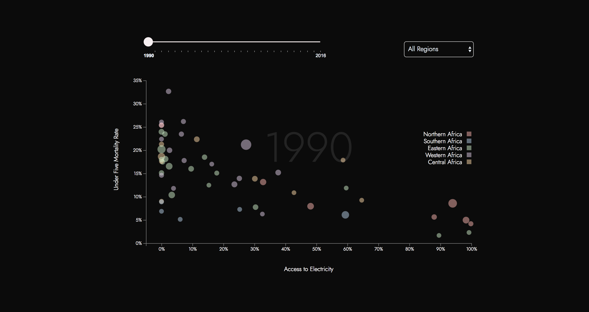

# Access to Electricity, Clean Cooking Technologies and Under Five Mortality Rate in Africa

### Description

According to the WHO, Africa remains the region were the risk of dying before completing five years of age remains the highest in the world. 
As part of the SDG agenda, the UN has set the goal of reducing the under five mortality rate to at least as low as 25 per 1000 live births. 
The following project explores the relationship between access to electricity, clean cooking technologies, under five morality rate in Africa 
and how have they have changed over time. 

### Visualization
[Link](https://alonsoag86.github.io/mstudio1/undp_project/)

### Image

### Sources

1. [World Bank](https://datacatalog.worldbank.org/dataset/sustainable-energy-all)
2. [WHO](http://apps.who.int/iris/bitstream/handle/10665/156847/9789241507646_eng.pdf?sequence=1&isAllowed=y)
3. [UNICEF](https://data.unicef.org/topic/child-survival/under-five-mortality/)
4. [Nigeria 2013 Health Survey](https://dhsprogram.com/pubs/pdf/fr293/fr293.pdf)
5. [Africa Clean Cooking Energy Solutions Initiative](http://siteresources.worldbank.org/EXTAFRREGTOPENERGY/Resources/WorldBank_ACCES_AFREA_AFTEG_ESMAP_FINAL.pdf)

### Acknowledgements

The following project was made possible thanks to the ongoing partnership between the [UNDP Regional
Bureau for Africa](http://www.africa.undp.org/content/rba/en/home.html) and the MS Data Visualization Program at 
[Parsons School of Design](https://www.newschool.edu/parsons/ms-data-visualization/). Visit the official [website](https://parsons.nyc/undp-renewable-energy/) 
to see all the projects developed during our Major Studio class.

