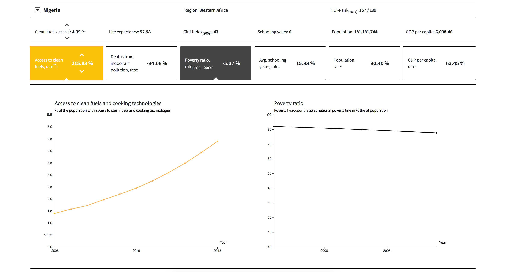

# Climbing the Energy Ladder – A Way out of Poverty?

I want to use the concept of the energy ladder to look at the relation between access to clean fuels and cooking technologies and SDG 1, poverty.  
To facilitate comparisons between the two I incorporate two approaches, a direct comparison of two indicators and a more holistic approach contextualizing poverty and development status.

[Link to the visualization](https://felixbuchholz.github.io/major-studio-1/climbing-the-energy-ladder/)