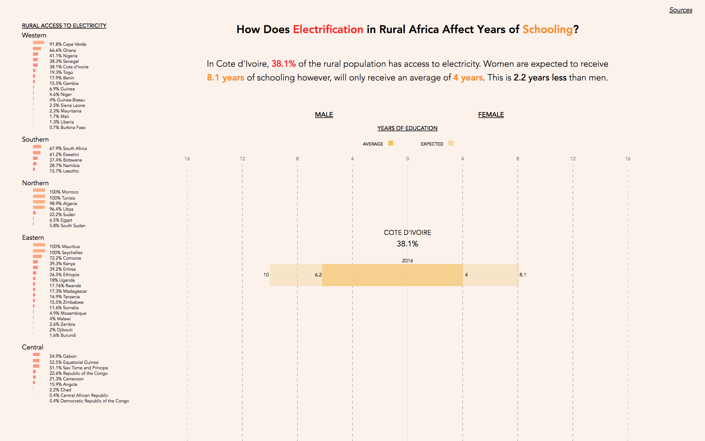

## How Does Electrification in Rural Africa Affect Years of Schooling?

#### Description 

##### Using a gender lens, this visualization explores how access to electricity in rural Africa affects years of schooling. When a rural household does not have access to electricity, they must rely on traditional fuel sources for domestic activities. According to the FAO, women bear the largest share of time and labor burdens associated with collecting fuel for domestic use. While there are several factors that affect the amount of education female's receive, household electrification has the ability to relieve time and labor burdens for rural women, allowing them to reallocate their time towards schooling. 

#### Image

#### Sources 

##### "Access to electricity (% of rural population with access)". World Bank, Sustainable Energy for All (SE4ALL) Database from The World Bank Data Catalog. 

##### "Burning Opportunity: Clean Household Energy for Health, Sustainable Development, and Wellbeing of Women and Children". World Health Organization (2016).

##### Winther, Tanja, Margaret N. Matinga, Kirsten Ulsrud, and Karina Standal. "Women's Empowerment through Electricity Access: Scoping Study and Proposal for a Framework of Analysis."Journal of Development Effectiveness 9, no. 3 (2017): 389-417. doi:10.1080/19439342.2017.1343368.

##### "Gender Inequalities in Rural Employment in Ghana: An Overview". Gender, Equity and Rural Employment Division of FAO (2012). 

##### "Mean years of schooling, female (years)" United Nations Development Programme, Human Development Reports, Human Development Data (1990-2017). 

##### "Mean years of schooling, male (years)" United Nations Development Programme, Human Development Reports, Human Development Data (1990-2017). 

##### "Expected years of schooling, male (years)" United Nations Development Programme, Human Development Reports, Human Development Data (1990-2017). 

##### "Expected years of schooling, female (years)" United Nations Development Programme, Human Development Reports, Human Development Data (1990-2017). 